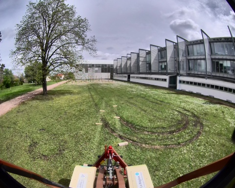
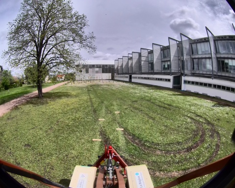
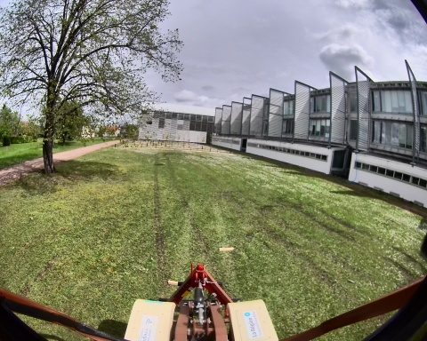
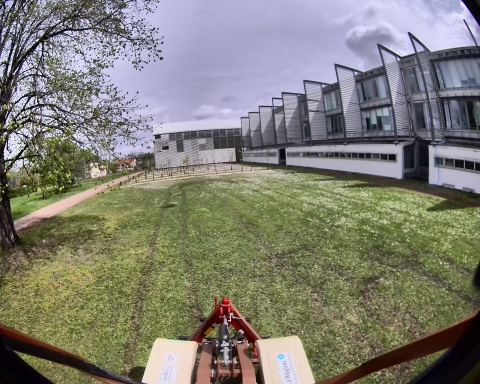
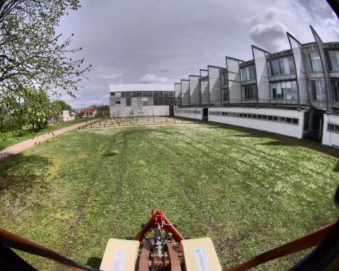

## ligne_osci_2_16_04_2025

**Chemin complet** : `/data/synchro_data/Innodura/Agrivia/Données/2025_bag_1/ligne_osci_2_16_04_2025`

#### [Trajectoire GPS](gps_traj.html)

### Images Associées

  
### Metadata

Files:             ligne_osci_2_16_04_2025_0.db3

Bag size:          721.9 MiB

Storage id:        sqlite3

Duration:          19.075754647s

Start:             Apr 16 2025 13:57:33.772125746 (1744804653.772125746)

End:               Apr 16 2025 13:57:52.847880393 (1744804672.847880393)

Messages:          22390

Topic information: Topic: /robot/localisation/filtered_odom | Type: nav_msgs/msg/Odometry | Count: 1895 | Serialization Format: cdr

                   Topic: /robot/imu/mag | Type: sensor_msgs/msg/MagneticField | Count: 1895 | Serialization Format: cdr

                   Topic: /robot/imu/velocity | Type: geometry_msgs/msg/TwistStamped | Count: 1895 | Serialization Format: cdr

                   Topic: /robot/joint_states | Type: sensor_msgs/msg/JointState | Count: 1897 | Serialization Format: cdr

                   Topic: /tf | Type: tf2_msgs/msg/TFMessage | Count: 2234 | Serialization Format: cdr

                   Topic: /robot/localisation/angular_speed | Type: romea_localisation_msgs/msg/ObservationAngularSpeedStamped | Count: 1896 | Serialization Format: cdr

                   Topic: /alpo/lidar/pointcloud_synchro | Type: sensor_msgs/msg/PointCloud2 | Count: 85 | Serialization Format: cdr

                   Topic: /robot/joystick/joy | Type: sensor_msgs/msg/Joy | Count: 222 | Serialization Format: cdr

                   Topic: /robot/base/bridge/vehicle_controller/odom | Type: nav_msgs/msg/Odometry | Count: 189 | Serialization Format: cdr

                   Topic: /robot/robot_description | Type: std_msgs/msg/String | Count: 1 | Serialization Format: cdr

                   Topic: /alpo/camera/image_synchro | Type: sensor_msgs/msg/Image | Count: 85 | Serialization Format: cdr

                   Topic: /robot/localisation/course | Type: romea_localisation_msgs/msg/ObservationCourseStamped | Count: 190 | Serialization Format: cdr

                   Topic: /robot/localisation/attitude | Type: romea_localisation_msgs/msg/ObservationAttitudeStamped | Count: 1896 | Serialization Format: cdr

                   Topic: /robot/localisation/status | Type: romea_localisation_msgs/msg/LocalisationStatus | Count: 1896 | Serialization Format: cdr

                   Topic: /robot/gps/ntrip/rtcm | Type: mavros_msgs/msg/RTCM | Count: 185 | Serialization Format: cdr

                   Topic: /robot/gps/nmea_sentence | Type: nmea_msgs/msg/Sentence | Count: 570 | Serialization Format: cdr

                   Topic: /rosout | Type: rcl_interfaces/msg/Log | Count: 284 | Serialization Format: cdr

                   Topic: /diagnostics | Type: diagnostic_msgs/msg/DiagnosticArray | Count: 165 | Serialization Format: cdr

                   Topic: /robot/localisation/twist | Type: romea_localisation_msgs/msg/ObservationTwist2DStamped | Count: 191 | Serialization Format: cdr

                   Topic: /tf_static | Type: tf2_msgs/msg/TFMessage | Count: 6 | Serialization Format: cdr

                   Topic: /robot/imu/imu_data_str | Type: std_msgs/msg/String | Count: 1897 | Serialization Format: cdr

                   Topic: /robot/localisation/position | Type: romea_localisation_msgs/msg/ObservationPosition2DStamped | Count: 190 | Serialization Format: cdr

                   Topic: /parameter_events | Type: rcl_interfaces/msg/ParameterEvent | Count: 0 | Serialization Format: cdr

                   Topic: /robot/gps/fix | Type: sensor_msgs/msg/NavSatFix | Count: 190 | Serialization Format: cdr

                   Topic: /robot/gps/vel | Type: geometry_msgs/msg/TwistStamped | Count: 162 | Serialization Format: cdr

                   Topic: /robot/imu/data | Type: sensor_msgs/msg/Imu | Count: 1896 | Serialization Format: cdr

                   Topic: /robot/base/controller/odometry | Type: romea_mobile_base_msgs/msg/OneAxleSteeringMeasureStamped | Count: 189 | Serialization Format: cdr

                   Topic: /robot/base/controller/odom | Type: nav_msgs/msg/Odometry | Count: 189 | Serialization Format: cdr

