## loop_1_28_05_2025

**Chemin complet** : `/data/synchro_data/Innodura/Agrivia/Données/2025_bag_1/loop_1_28_05_2025`

#### [Trajectoire GPS](gps_traj.html)

### Images Associées

 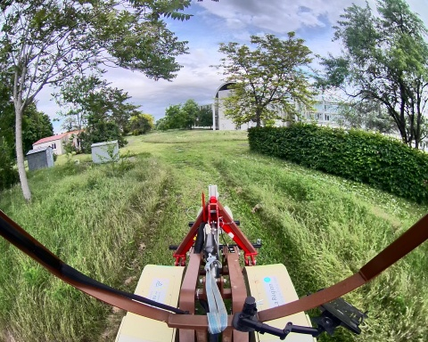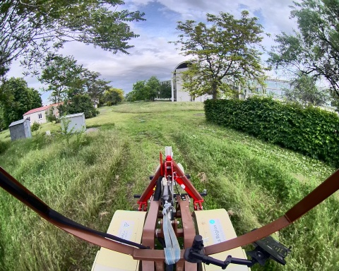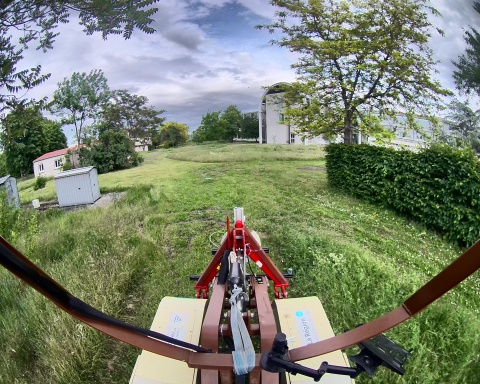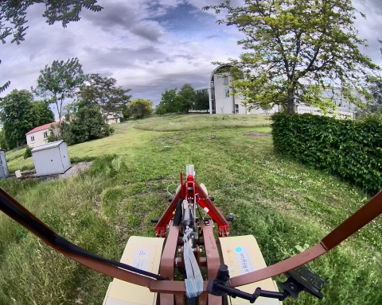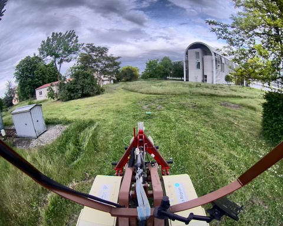 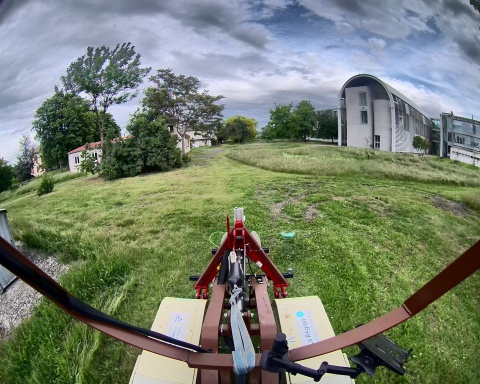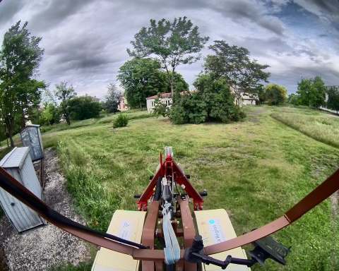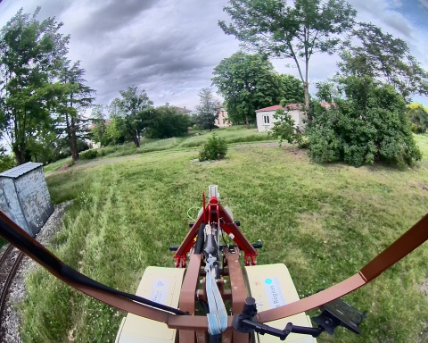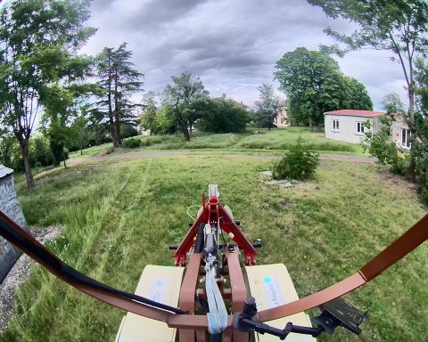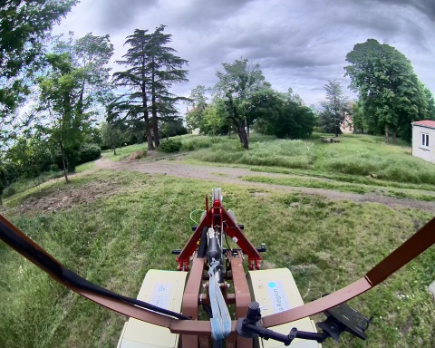 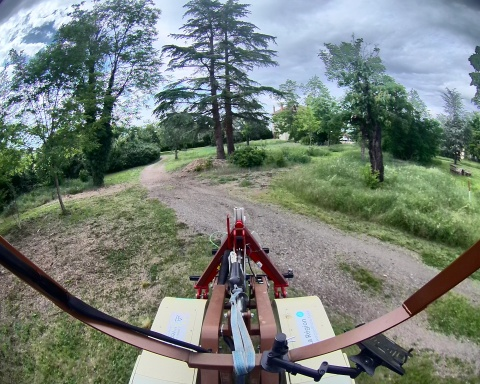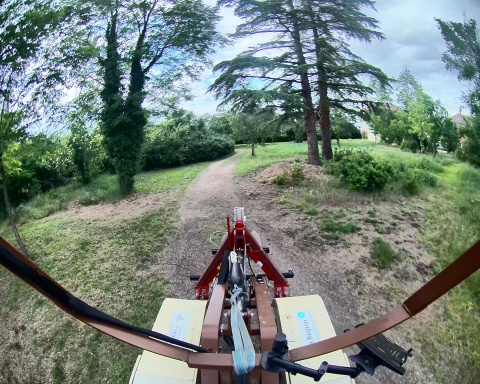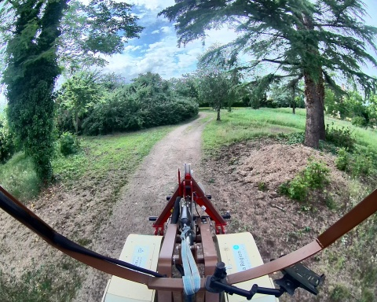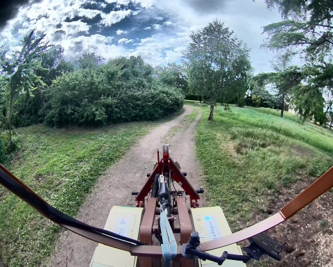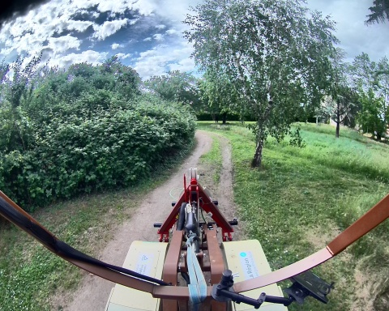 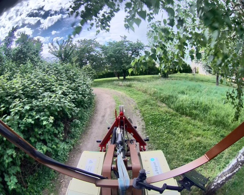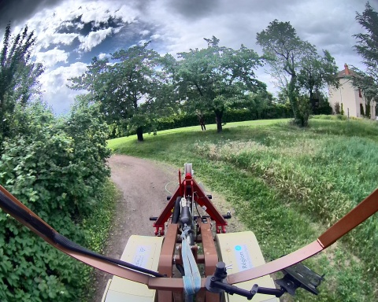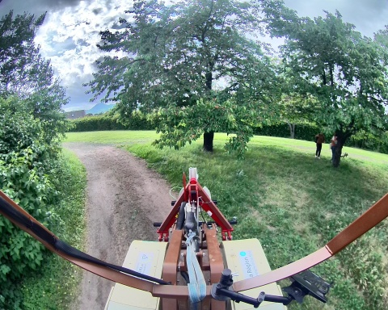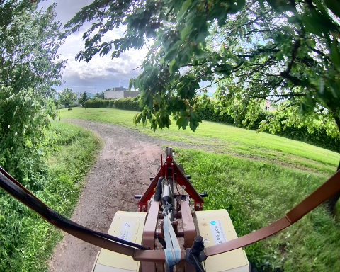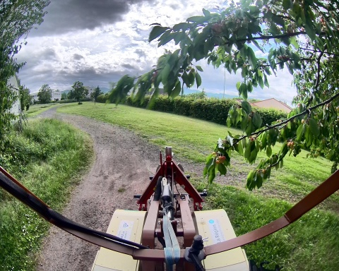 
### Metadata

Files:             loop_1_28_05_2025_0.db3

Bag size:          1.9 GiB

Storage id:        sqlite3

Duration:          59.887491919s

Start:             May 28 2025 17:02:28.734138630 (1748444548.734138630)

End:               May 28 2025 17:03:28.621630549 (1748444608.621630549)

Messages:          70549

Topic information: Topic: /robot/base/controller/odom | Type: nav_msgs/msg/Odometry | Count: 598 | Serialization Format: cdr

                   Topic: /robot/base/controller/odometry | Type: romea_mobile_base_msgs/msg/OneAxleSteeringMeasureStamped | Count: 598 | Serialization Format: cdr

                   Topic: /robot/localisation/filtered_odom | Type: nav_msgs/msg/Odometry | Count: 5873 | Serialization Format: cdr

                   Topic: /robot/imu/mag | Type: sensor_msgs/msg/MagneticField | Count: 5977 | Serialization Format: cdr

                   Topic: /robot/gps/ntrip/rtcm | Type: mavros_msgs/msg/RTCM | Count: 554 | Serialization Format: cdr

                   Topic: /robot/imu/velocity | Type: geometry_msgs/msg/TwistStamped | Count: 5977 | Serialization Format: cdr

                   Topic: /robot/joint_states | Type: sensor_msgs/msg/JointState | Count: 5978 | Serialization Format: cdr

                   Topic: /tf | Type: tf2_msgs/msg/TFMessage | Count: 6933 | Serialization Format: cdr

                   Topic: /robot/joystick/joy | Type: sensor_msgs/msg/Joy | Count: 933 | Serialization Format: cdr

                   Topic: /robot/localisation/course | Type: romea_localisation_msgs/msg/ObservationCourseStamped | Count: 529 | Serialization Format: cdr

                   Topic: /robot/localisation/attitude | Type: romea_localisation_msgs/msg/ObservationAttitudeStamped | Count: 5977 | Serialization Format: cdr

                   Topic: /robot/localisation/status | Type: romea_localisation_msgs/msg/LocalisationStatus | Count: 5977 | Serialization Format: cdr

                   Topic: /robot/imu/data | Type: sensor_msgs/msg/Imu | Count: 5977 | Serialization Format: cdr

                   Topic: /robot/gps/nmea_sentence | Type: nmea_msgs/msg/Sentence | Count: 1791 | Serialization Format: cdr

                   Topic: /robot/robot_description | Type: std_msgs/msg/String | Count: 1 | Serialization Format: cdr

                   Topic: /robot/base/bridge/vehicle_controller/odom | Type: nav_msgs/msg/Odometry | Count: 598 | Serialization Format: cdr

                   Topic: /alpo/camera/image_synchro | Type: sensor_msgs/msg/Image | Count: 320 | Serialization Format: cdr

                   Topic: /rosout | Type: rcl_interfaces/msg/Log | Count: 840 | Serialization Format: cdr

                   Topic: /diagnostics | Type: diagnostic_msgs/msg/DiagnosticArray | Count: 496 | Serialization Format: cdr

                   Topic: /robot/localisation/angular_speed | Type: romea_localisation_msgs/msg/ObservationAngularSpeedStamped | Count: 5977 | Serialization Format: cdr

                   Topic: /alpo/lidar/pointcloud_synchro | Type: sensor_msgs/msg/PointCloud2 | Count: 320 | Serialization Format: cdr

                   Topic: /tf_static | Type: tf2_msgs/msg/TFMessage | Count: 6 | Serialization Format: cdr

                   Topic: /robot/localisation/twist | Type: romea_localisation_msgs/msg/ObservationTwist2DStamped | Count: 598 | Serialization Format: cdr

                   Topic: /robot/imu/imu_data_str | Type: std_msgs/msg/String | Count: 5978 | Serialization Format: cdr

                   Topic: /robot/localisation/position | Type: romea_localisation_msgs/msg/ObservationPosition2DStamped | Count: 597 | Serialization Format: cdr

                   Topic: /parameter_events | Type: rcl_interfaces/msg/ParameterEvent | Count: 0 | Serialization Format: cdr

                   Topic: /robot/gps/fix | Type: sensor_msgs/msg/NavSatFix | Count: 597 | Serialization Format: cdr

                   Topic: /robot/gps/vel | Type: geometry_msgs/msg/TwistStamped | Count: 549 | Serialization Format: cdr

